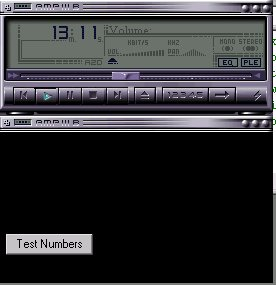



## Use real winamp skins in Vb

### Description

Hi this code will show you how to add real winamp skins to your players. I know that there are tones of code out there and on here to show you how to add skins to programs. But I wanted a real winamp look on a players I made. and if your anything like me that can't draw to save my life I desided that this was a good idea. well any way place vote if you like it. I will be updateing this soon agian.
 
### More Info
 

             |
---                |---
**Submitted On**   |2000-12-13 00:26:46
**By**             |[dreamvb](https://github.com/Planet-Source-Code/PSCIndex/blob/master/ByAuthor/dreamvb.md)
**Level**          |Advanced
**User Rating**    |4.4 (22 globes from 5 users)
**Compatibility**  |VB 6\.0
**Category**       |[Graphics](https://github.com/Planet-Source-Code/PSCIndex/blob/master/ByCategory/graphics__1-46.md)
**World**          |[Visual Basic](https://github.com/Planet-Source-Code/PSCIndex/blob/master/ByWorld/visual-basic.md)
**Archive File**   |[CODE\_UPLOAD1284512192000\.zip](https://github.com/Planet-Source-Code/dreamvb-use-real-winamp-skins-in-vb__1-13707/archive/master.zip)

